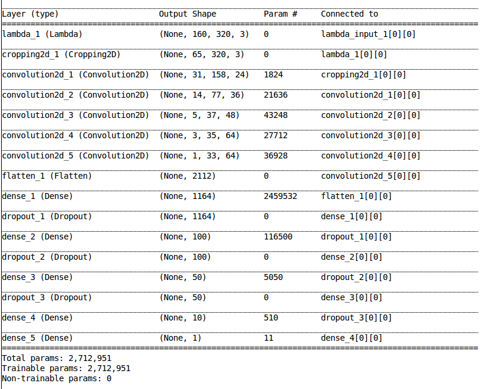
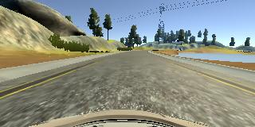
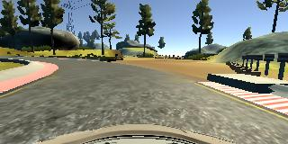

# **Behavioral Cloning** 
[](http://www.udacity.com/drive)

Overview
---

The goals / steps of this project are the following:
* Use the simulator to collect data of good driving behavior
* Build, a convolution neural network in Keras that predicts steering angles from images
* Train and validate the model with a training and validation set
* Test that the model successfully drives around track one without leaving the road
* Summarize the results with a written report


## Rubric Points
Here I will consider the [rubric points](https://review.udacity.com/#!/rubrics/432/view) individually and describe how I addressed each point in my implementation.  

---

### Files Submitted & Code Quality

#### 1. Submission includes all required files and can be used to run the simulator in autonomous mode

My project includes the following files:
* model.py containing the script to create and train the model
* drive.py for driving the car in autonomous mode
* model.h5 containing a trained convolution neural network 
* writeup_report.md summarizing the results

#### 2. Submission includes functional code

Using the Udacity provided simulator and my drive.py file, the car can be driven autonomously around the track by executing 
```sh
python drive.py model.h5
```

#### 3. Submission code is usable and readable

The model.py file contains the code for training and saving the convolution neural network. The file shows the pipeline I used for training and validating the model, and it contains comments to explain how the code works.

---

### Model Architecture and Training Strategy

#### 1. An appropriate model architecture has been employed

My model consists of a convolution neural network motivated by NVIDIA's Autonomous Vehicles development team (model.py lines 101-117) 

The model includes both ELU RELU layers to introduce nonlinearity (code line 107-108), and the data is normalized in the model using a Keras lambda layer (code line 102). 

#### 2. Attempts to reduce overfitting in the model

The model contains dropout layers in order to reduce overfitting (model.py lines 111-115). 

The model was trained and validated on different data sets to ensure that the model was not overfitting. The model was tested by running it through the simulator and ensuring that the vehicle could stay on the track.

#### 3. Model parameter tuning

The model used an adam optimizer, and the learning rate was kept at 0.0001 (model.py line 119).

#### 4. Appropriate training data

Training data was chosen to keep the vehicle driving on the road. I used a combination of center lane driving, recovering from the left and right sides of the road. I drove the car in the opposite direction as well so as to avoid any biases possible. I collected more data in the simulation by driving the car on both the given tracks in both the directions. Moreover, in order to get more data, I applied random brightness, rotation and translation to certain images in my dataset.

For details about how I created the training data, see the next section. 

### Model Architecture and Training Strategy

#### 1. Solution Design Approach

The overall strategy for deriving a model architecture was to have enough data and not very complex model.

My first step was to use a convolution neural network model similar to the LeNet I thought this model might be appropriate because LeNet is easy to understand and works well with image data.

In order to gauge how well the model was working, I split my image and steering angle data into a training and validation set. I found that my first model had a low mean squared error on the training set but a high mean squared error on the validation set. This implied that the model was overfitting. 

To combat the overfitting, I collected more data. I monitored training and validation losses at all times to ensure that I am neighter underfitting nor am I overfitting. Collection of enough data, further helped me allivate the overfitting problem. Cropping the images also helped me reduce my training time.

Then I tried a more advanced NN architecture based on the one used by NVIDIA's team. It consists of 5 Convolutional layers followed by 4 Fully Connected layers followed by the output layer. I introduced l2 weight regularization to get smooth ride output.

The final step was to run the simulator to see how well the car was driving around track one. There were a few spots where the vehicle fell off the track, for example at sharp turns. To improve the driving behavior in these cases, I replicated extreme cases and collected images at such extreme situations (for example, recovering from extreme left/right etc.)

At the end of the process, the vehicle is able to drive autonomously around the track without leaving the road.

#### 2. Final Model Architecture

The final model architecture (model.py lines 101-117) consisted of a convolution neural network with the following layers and layer sizes:

First phrase: 3 convolution layers are applied with 5x5 filter size but the depth increases at each layer such as 24, 36, 48. Then, 2 convolution layers are applied with 3x3 filter size and 64 depth. ELU activation is applied after every convolution layers.
Second phrase: data from previous layer is flattened and densed to 1164, 100, 50, 10 and 1. Upon digging through student forum, I also thought to add L2 weight regularization in every convolution and dense layers to produce a smoother driving performance, but removed it when I noticed increased loss values.

Here is a visualization of the architecture:


And my code bit:



#### 3. Creation of the Training Set & Training Process

To capture good driving behavior, I first recorded two laps on track one using center lane driving. Here are 2 example images of center lane driving:




I then recorded the vehicle recovering from the left side and right sides of the road back to center so that the vehicle would learn to recover in extreme cases.

Then I repeated this process on track two in order to get more data points.

After the collection process, I had  number of data points. I then preprocessed this data by brightening, rotating and randomly translating these images. I also flipped the images (left-right flipping) so as to remove the directional bias that could otherwise be caused by track 1 driving.

I finally randomly shuffled the data set and put 20% of the data into a validation set. 

I used this training data for training the model. The validation set helped determine if the model was over or under fitting. The ideal number of epochs was 48 as evidenced by dropping losses till then. I used an adam optimizer and used a learning rate of 0.0001. Further, using generator helped me avoid the memory leak, as the images we are dealing with are huge, generator helps in deleting unnecessary info and just appends to a list.

---

* **Problems/ Issues faced:** I got pretty good results using generator and NVIDIA developer teams' motivated architecture, however, for track 2, I was not very successful. Funny thing is that my data with only images from track 1 gave me much better output than the data from both the tracks combined. Also, early stopping helped as well. When I gave more epochs, my training and validation accuracies stayed constant (or loss increased in some cases). It was exciting to work using VIM editor as compared to much more user friendly notebook environment provided by iPython/ Jupyter. Another issue was that when I had a lot of data, I felt that my model was underfitting and I edited the "keep_prob" value to overcome that issue.
